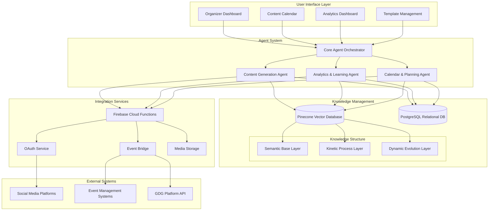

# Technical Architecture

This document provides an overview of the technical architecture for the GDG Community Companion.

## System Architecture Overview

## Core Components

### 1. Knowledge Management Layer

The foundation of the system leverages Pinecone's vector database, optimized for agentic workloads:

#### Pinecone Vector Database Implementation

- **Namespace Structure**:
  - Primary namespace per GDG chapter (e.g., `gdg-providence`)
  - Sub-namespaces for content categories (e.g., `events`, `posts`, `templates`)
  - Personal namespaces for individual organizers within chapters (e.g., `organizer-jane`)

- **Vector Types**:
  - Dense vectors for semantic understanding (using embeddings from Google's text-embedding models)
  - Sparse vectors for keyword/lexical search (using Pinecone's sparse embedding model)

#### PostgreSQL Relational Database

For structured data that benefits from relational integrity:
- User account management (organizers, permissions)
- Event management (dates, locations, speakers)
- Social account connections
- Posting schedules and calendars
- Analytics aggregations

### 2. Agent System

Based on Google's ADK with specialized capabilities:

#### Core Agent Orchestrator

- Manages the coordination between specialized agents
- Handles user intent identification and task routing
- Maintains conversation context and task state

#### Content Generation Agent

- Specialized for creating social media content
- Accesses chapter style guides and content templates
- Generates platform-optimized content variations
- Implements content approval workflows

#### Analytics & Learning Agent

- Analyzes content performance across platforms
- Identifies patterns in successful content
- Recommends optimizations to future content
- Updates the Dynamic Evolution Layer with learnings

#### Planning & Calendar Agent

- Manages content calendar and scheduling
- Coordinates cross-platform posting strategies
- Aligns content with event timelines
- Suggests optimal posting times based on analytics

### 3. Three-Layer Knowledge Structure

#### Semantic Base Layer

- Content templates and brand guidelines
- Core concepts and terminology
- Chapter identity and voice characteristics
- Community demographics and interests

#### Kinetic Process Layer

- Content creation workflows and approval processes
- Event promotion sequences (before, during, after)
- Cross-platform posting strategies
- Engagement response patterns

#### Dynamic Evolution Layer

- Performance metrics and success patterns
- Learned optimization strategies
- Historical engagement trends
- Evolving content style adaptations

### 4. Integration Services

- **Firebase Cloud Functions**: Serverless functions for API integrations
- **OAuth Service**: Secure management of platform credentials
- **Event Bridge**: Connects with GDG event management systems
- **Media Storage**: Manages media assets and optimizations

### 5. User Interface Layer

- **Organizer Dashboard**: Main interface for GDG organizers
- **Content Calendar**: Visual timeline of scheduled content
- **Analytics Dashboard**: Performance metrics visualization
- **Template Management**: Library of content templates

## Deployment Architecture

Cloud-based deployment using Google Cloud Platform:

- **Frontend**: Firebase Hosting
- **Backend Services**: Cloud Functions and Cloud Run
- **Authentication**: Firebase Authentication
- **Vector Database**: Pinecone Serverless
- **Relational Database**: Cloud SQL (PostgreSQL)
- **Media Storage**: Cloud Storage
- **Monitoring**: Cloud Monitoring and Logging
