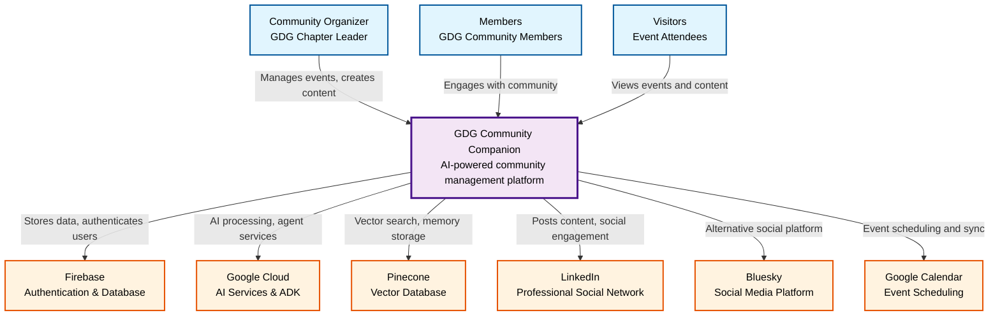
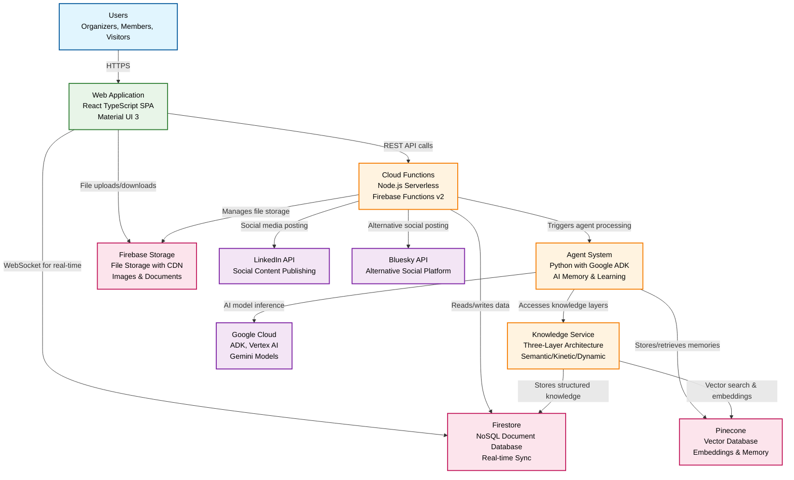
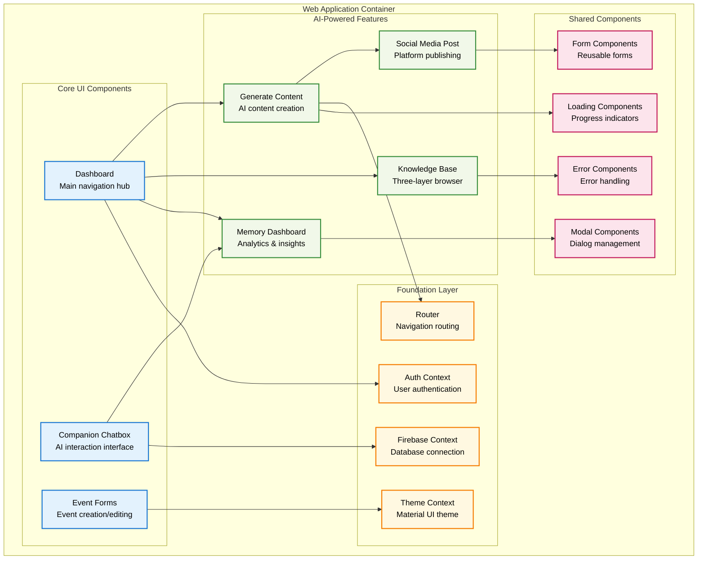
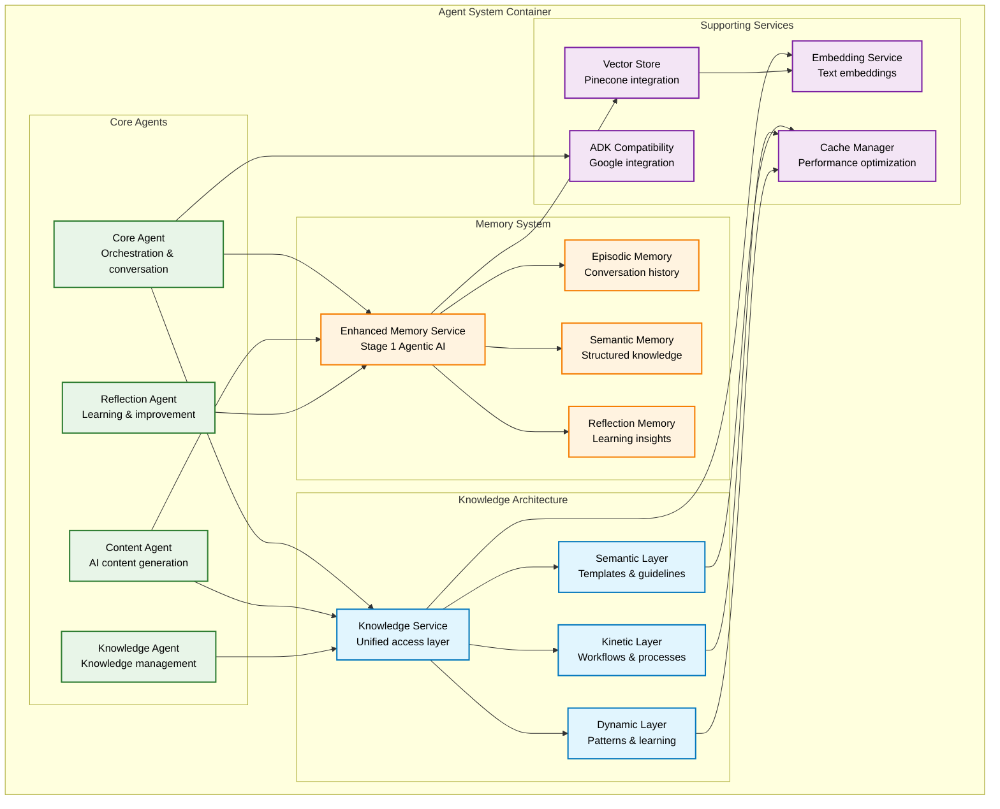
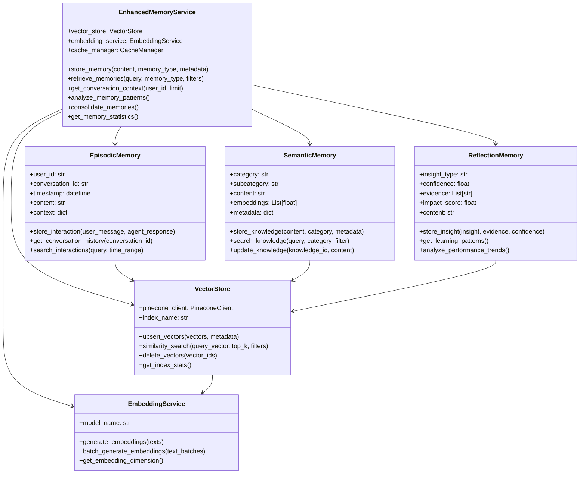
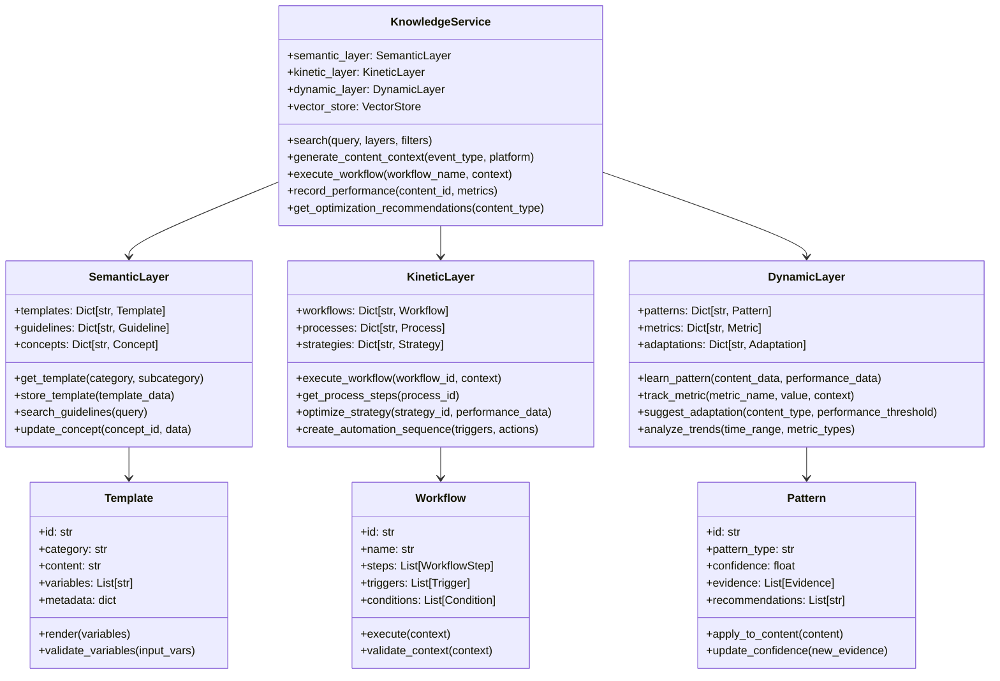

# C4 Architecture Model - GDG Community Companion

This document describes the GDG Community Companion architecture using the C4 model (Context, Containers, Components, Code).

## Table of Contents
- [Level 1: System Context](#level-1-system-context)
- [Level 2: Container Diagram](#level-2-container-diagram)
- [Level 3: Component Diagram](#level-3-component-diagram)
- [Level 4: Code Diagram](#level-4-code-diagram)
- [Architecture Decision Records](#architecture-decision-records)

---

## Level 1: System Context

The system context diagram shows how the GDG Community Companion fits into the broader ecosystem.

### Key Relationships

- **Community Organizers** use the system to manage events, create content, and analyze community engagement
- **Members** engage with community content and event information
- **Visitors** discover events and community information
- **Firebase** provides authentication, real-time database, and cloud functions
- **Google Cloud** powers AI agents and provides ADK services
- **Pinecone** stores vector embeddings for semantic search and memory
- **LinkedIn & Bluesky** serve as content distribution platforms
- **Google Calendar** synchronizes events and scheduling

---

## Level 2: Container Diagram

The container diagram shows the high-level architecture of the GDG Community Companion system.

### Container Responsibilities

#### Web Application (React TypeScript)
- **Purpose**: User interface for community management
- **Technology**: React 18, TypeScript, Material UI 3
- **Key Features**: 
  - Event management interface
  - AI content generation tools
  - Memory and knowledge dashboards
  - Social media posting interface
  - Real-time community chat

#### Cloud Functions (Node.js)
- **Purpose**: Serverless API layer and business logic
- **Technology**: Node.js 20, Firebase Functions v2
- **Key Features**:
  - RESTful API endpoints
  - Authentication middleware
  - Event processing and triggers
  - Social media integration
  - File processing workflows

#### Agent System (Python + ADK)
- **Purpose**: AI-powered automation and intelligence
- **Technology**: Python 3.11+, Google ADK, UV package manager
- **Key Features**:
  - Enhanced memory system (episodic, semantic, reflection)
  - Content generation agents
  - Knowledge management agents
  - Learning and optimization agents
  - Google ADK compatibility layer

#### Knowledge Service (Three-Layer Architecture)
- **Purpose**: Intelligent knowledge management across layers
- **Technology**: Python, vector embeddings, structured data
- **Key Features**:
  - Semantic layer (templates, guidelines)
  - Kinetic layer (workflows, processes)
  - Dynamic layer (learning, patterns)
  - Cross-layer search and integration

---

## Level 3: Component Diagram

### Frontend Components (Web Application)

### Backend Components (Agent System)

---

## Level 4: Code Diagram

### Enhanced Memory Service Implementation

### Knowledge Service Architecture

---

## Technology Stack

### Frontend Technologies
- **React 18**: Modern React with hooks and concurrent features
- **TypeScript**: Type safety and enhanced developer experience
- **Material UI 3**: Google's Material Design system
- **Firebase SDK**: Real-time database and authentication

### Backend Technologies
- **Node.js 20**: Modern JavaScript runtime for Cloud Functions
- **Python 3.11+**: Agent system and AI processing
- **Google ADK**: Agent Development Kit for AI agents
- **UV**: Fast Python package manager

### Data & Storage
- **Firestore**: NoSQL document database with real-time sync
- **Firebase Storage**: File storage with CDN capabilities
- **Pinecone**: Vector database for embeddings and semantic search

### AI & Machine Learning
- **Vertex AI**: Google Cloud's AI platform
- **Gemini Models**: Large language models for content generation
- **OpenAI Embeddings**: Text embeddings for vector search

### External Integrations
- **LinkedIn API**: Professional social media platform
- **Bluesky API**: Decentralized social media platform
- **Google Calendar**: Event scheduling and synchronization

---

## Architecture Decision Records

This architecture is guided by the following key ADRs:

### Foundation Architecture
- **[ADR-001](../decisions/0001-three-layer-knowledge-architecture.md)**: Three-Layer Knowledge Architecture
- **[ADR-002](../decisions/0002-multi-agent-architecture.md)**: Multi-Agent Architecture with ADK
- **[ADR-004](../decisions/0004-firebase-platform.md)**: Firebase as Primary Platform

### AI & Intelligence
- **[ADR-028](../decisions/0028-adk-best-practices-implementation.md)**: Google ADK Best Practices Implementation
- **[ADR-034](../decisions/0034-stage-1-enhanced-memory-implementation.md)**: Stage 1 Enhanced Memory Implementation
- **[ADR-035](../decisions/0035-three-layer-knowledge-architecture-implementation.md)**: Three-Layer Knowledge Architecture Implementation

### Platform & Integration
- **[ADR-006](../decisions/0006-pinecone-vector-database.md)**: Pinecone for Vector Database
- **[ADR-009](../decisions/0009-social-platform-integration-strategy.md)**: Social Platform Integration Strategy

### Security & Deployment
- **[ADR-012](../decisions/0012-public-private-repository-strategy.md)**: Public-Private Repository Strategy
- **[ADR-036](../decisions/0036-open-source-feature-transfer.md)**: Open Source Feature Transfer

---

## Quality Attributes

### Performance
- **Response Time**: < 2 seconds for UI interactions
- **Vector Search**: < 500ms for semantic search queries
- **Memory Retrieval**: < 1 second for context loading
- **Content Generation**: < 10 seconds for AI-generated content

### Scalability
- **Users**: Support 1000+ concurrent users per chapter
- **Data**: Handle 100,000+ events and posts per chapter
- **Memory**: Store and search 1 million+ memory items
- **Knowledge**: Manage 50,000+ knowledge items across layers

### Security
- **Authentication**: Firebase Auth with MFA support
- **Authorization**: Role-based access control (RBAC)
- **Data Encryption**: TLS in transit, AES-256 at rest
- **API Security**: Rate limiting and input validation

### Availability
- **Uptime**: 99.9% availability target
- **Disaster Recovery**: < 4 hours RTO, < 1 hour RPO
- **Monitoring**: Real-time alerting and health checks
- **Backup**: Automated daily backups with point-in-time recovery

### Maintainability
- **Code Quality**: 85%+ test coverage, strict TypeScript
- **Documentation**: Comprehensive ADRs and API docs
- **Modularity**: Clean separation of concerns
- **Monitoring**: Application performance monitoring (APM)

---

## Deployment Architecture

### Development Environment
- **Local Development**: Firebase emulators, Docker containers
- **Testing**: Automated CI/CD with GitHub Actions
- **Staging**: Firebase staging project with production parity

### Production Environment
- **Frontend**: Firebase Hosting with global CDN
- **Backend**: Firebase Cloud Functions with auto-scaling
- **Database**: Firestore with multi-region replication
- **AI Services**: Google Cloud with dedicated quotas

### Monitoring & Operations
- **Application Monitoring**: Firebase Performance Monitoring
- **Error Tracking**: Firebase Crashlytics
- **Analytics**: Google Analytics 4 with custom events
- **Logging**: Cloud Logging with structured logs

---

*This C4 architecture documentation follows the C4 model principles and reflects the current implementation as of 2025-06-16. For updates and detailed implementation guidance, refer to the corresponding ADRs and component documentation.*